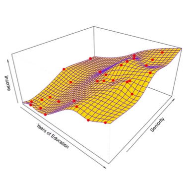

# AI & 기계학습 기초

생성 일시: 2026년 3월 17일 오후 2:03

# 1. AI?

- 주어진 환경, 데이터를 인지,학습,추론을 통해 목표 달성을 하도록 예측, 행동 선택, 계획하는 시스템

## ML(Machine Learning)

- AI 범주 내에서 데이터로부터 학습하여 목적을 달성하는 접근 방법론
- LLM, 이미지 분류 모델, 추천 시스템

## DL(Deep Learning)

- ML 범주 내에서 신경망(Neural Networ) 함수를 사용한 학습 방법론

> [!NOTE]
> **AI > ML > DL**

**AI - ML (AI지만 ML이 아닌 것)**
- 휴리스틱 기반 최적화 알고리즘, 규칙 기반 시스템

# 2. 데이터의 구성요소

## Feature(피처, 특성)

- 모델이 예측에 사용하는 ‘입력 정보’
- 예측, 판단의 근거/단서

## Label(라벨, 목표값)

- 모델이 예측하려는 정답
- 학습의 목표값

## 예시

- Feautre : 영상의 정보(장르, 제작자, 조회수, ..) - Label : 좋아요, 시청 여

# 3-1. 1D(1차원) 피쳐 기반 학습

- Feature가 1개일 때 머신러닝의 형태
- 주어진 데이터를 바탕으로 어떠한 함수 f를 산출함
- 실제 데이터는 참 함수 $f^*$로부터 오차  $\epsilon_i$만큼 떨어져 있는 것으로 생각
- **따라서 데이터 = 참 함수  $f^*$ +  각 원소별 오차  $\epsilon_i$**

> [!NOTE]
> 
> ### 참 함수는 관측될 수 없다
> 
> - 뭐가 있는건 맞는데 뭔지는 모른다. 최대한 근사한 함수를 찾아나가는 과정이 학습

# 3-2. 모델과 가설 공간

## 학습

- 입력(피쳐) → 출력(라벨) 관계를 찾는 과정 (함수 f 를 찾기)
- 평균 관계를 **하나의 함수**로 표현함
- **그러나 관계를 표현할 수 있는 함수는 무수히 많다**

## 가설 공간

- 관계를 표현할 수 있는 모든 후보 함수들의 집합
- 피쳐 공간(정의역), 라벨 공간(치역) 에서의 함수들의 집합

## 모델

- 가설 공간 F에 속한 특정 함수 f

# 3-3. 학습?

- 주어진 데이터에서 정답을 가장 잘 맞출 수 있게끔 모델의 규칙을 조정하는 과정
- 즉 최적의 함수 f를 찾아 나가는 과정임
- 데이터 → 가설공간 $F$ → 선택 모델 $f$

## 학습에 필요한 3가지

1. 데이터
    - 정답지 모음(이걸 바탕으로 학습해야 함)
2. 가설 공간
    - 모든 후보 함수의 집합(최적의 함수를 찾아야 함)
3. 선택 기준(손실 함수)
    - 어떤 함수가 더 좋은지 판단하는 척도
    - 예측값 - 실제값 차이 측정

## 학습 과정 (D → $F$ → $f$)

1. D로부터 F가 가능한 모든 함수 제시
2. 각 함수들을 실제 D와 비교하며 정확도 측정
3. 각 함수들의 정확도를 비교하며 가장 정확한 최적의 함수 f 탐색

# 4-1. 2D 피쳐 기반 학습

  

그래프가 3차원임(두 개의 변수로부터 라벨을 찾아내야)

> [!INFO]
> ## 모든 데이터와 일치하는 비선형 함수는 좋은 함수는 아니다
> - 제공되는 모든 데이터에 부합하는(모든 데이터의  $\epsilon_i$가 0인) 함수는 결국 관측 데이터의 노이즈까지 포함하는 함수임
> - 과적합(Overfitting)이 될 수 있음
> - 최적의 함수는 데이터의 전체 오차의 합(or 평균)을 최소화하는 함수

# 일반적인 p차원 피쳐의 표기

$$
일반적인\ p차원\ 피쳐 \ 벡터 \ \mathbf{X} = \begin{bmatrix} X_1 \\ X_2 \\ \vdots \\X_p \end{bmatrix} \in \mathbb{R}
$$

# 학습 이유

- 잘 학습된 $f$를 구하면 이후 주어지는 x에 대해 반응 Y를 예측할 수 있음
- 여러 피쳐들 중 무엇이 더 중요한지(더 큰 상관관계를 갖는지) 중요도를 파악할 수 있음

